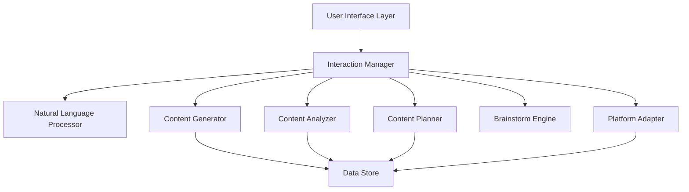

# Design Document: Content Creation Assistant

## Overview

The Content Creation Assistant is a conversational, AI-powered system that guides users through the creative process of developing digital content. The system architecture emphasizes natural language interaction, iterative refinement, and multi-format content generation while maintaining a visual, intuitive user experience.

The design follows a modular architecture with clear separation between:
- Natural language processing and understanding
- Content generation and transformation
- User interaction and guidance
- Content storage and retrieval
- Platform-specific adaptation logic

The system operates as an interactive assistant that maintains conversation context, tracks user progress through content development workflows, and provides intelligent suggestions based on content analysis and platform best practices.

## Architecture

### High-Level Architecture



### Component Responsibilities

**User Interface Layer**: Provides the visual, creative interface for user interaction. Handles input collection, displays suggestions and content, and manages the step-by-step workflow presentation.

**Interaction Manager**: Orchestrates the conversation flow, maintains session state, routes requests to appropriate components, and manages the step-by-step guidance process.

**Natural Language Processor**: Parses user input, extracts key themes and topics, identifies intent, and generates conversational responses and clarifying questions.

**Content Generator**: Creates content in various formats based on user ideas, applies platform-specific formatting, and generates variations and alternatives.

**Content Analyzer**: Evaluates content for clarity, engagement potential, and platform appropriateness. Identifies improvement opportunities and generates specific suggestions.

**Platform Adapter**: Transforms content for specific platforms, applies platform best practices, and generates platform-specific metadata (hashtags, captions, timing recommendations).

**Brainstorm Engine**: Generates creative suggestions, organizes ideas by theme, creates variations, and helps users explore creative possibilities.

**Content Planner**: Organizes multiple content items, manages content status and scheduling, and handles export functionality.

**Data Store**: Persists user content, session state, content plans, and user preferences.

## Components and Interfaces

### Natural Language Processor

**Purpose**: Parse and understand user input in plain language

**Interface**:
```typescript
interface NaturalLanguageProcessor {
  parseInput(text: string): ParsedInput
  extractThemes(text: string): Theme[]
  generateClarifyingQuestions(input: ParsedInput): Question[]
  analyzeCompleteness(input: ParsedInput): CompletenessScore
}

interface ParsedInput {
  rawText: string
  intent: Intent
  themes: Theme[]
  contentType?: ContentFormat
  targetPlatform?: Platform
  completeness: CompletenessScore
}

interface Theme {
  name: string
  keywords: string[]
  confidence: number
}

interface Question {
  text: string
  purpose: string
  suggestedAnswers?: string[]
}

type CompletenessScore = {
  score: number  // 0-1
  missingElements: string[]
}
```

### Content Generator

**Purpose**: Generate structured content in various formats

**Interface**:
```typescript
interface ContentGenerator {
  generateFromIdea(idea: ContentIdea, format: ContentFormat): GeneratedContent
  generateMultiFormat(idea: ContentIdea, formats: ContentFormat[]): MultiFormatContent
  applyRefinements(content: GeneratedContent, refinements: Refinement[]): GeneratedContent
  generateVariations(content: GeneratedContent, count: number): GeneratedContent[]
}

interface ContentIdea {
  id: string
  description: string
  themes: Theme[]
  targetAudience?: string
  tone?: string
}

interface GeneratedContent {
  id: string
  format: ContentFormat
  content: string
  metadata: ContentMetadata
  version: number
}

interface MultiFormatContent {
  sourceIdea: ContentIdea
  formats: Map<ContentFormat, GeneratedContent>
}

type ContentFormat = 
  | 'short-video-concept'
  | 'social-post'
  | 'caption'
  | 'visual-plan'
  | 'blog-outline'
```

### Content Analyzer

**Purpose**: Analyze content quality and provide improvement suggestions

**Interface**:
```typescript
interface ContentAnalyzer {
  analyzeClarity(content: GeneratedContent): ClarityAnalysis
  analyzeEngagement(content: GeneratedContent): EngagementAnalysis
  generateSuggestions(content: GeneratedContent): Suggestion[]
  compareVersions(v1: GeneratedContent, v2: GeneratedContent): VersionComparison
}

interface ClarityAnalysis {
  score: number  // 0-1
  issues: ClarityIssue[]
  strengths: string[]
}

interface ClarityIssue {
  type: 'vague' | 'complex' | 'inconsistent' | 'unclear-structure'
  location: string
  description: string
  severity: 'low' | 'medium' | 'high'
}

interface EngagementAnalysis {
  score: number  // 0-1
  factors: EngagementFactor[]
  recommendations: string[]
}

interface Suggestion {
  id: string
  type: 'clarity' | 'engagement' | 'structure' | 'style'
  original: string
  suggested: string
  explanation: string
  impact: 'low' | 'medium' | 'high'
}
```

### Platform Adapter

**Purpose**: Adapt content for specific social media platforms

**Interface**:
```typescript
interface PlatformAdapter {
  adaptForPlatform(content: GeneratedContent, platform: Platform): PlatformContent
  generatePlatformMetadata(content: GeneratedContent, platform: Platform): PlatformMetadata
  validatePlatformConstraints(content: PlatformContent): ValidationResult
}

interface PlatformContent {
  platform: Platform
  content: string
  format: ContentFormat
  metadata: PlatformMetadata
  constraints: PlatformConstraints
}

interface PlatformMetadata {
  hashtags: string[]
  caption?: string
  suggestedPostingTime?: string
  contentWarnings?: string[]
}

interface PlatformConstraints {
  maxLength?: number
  minLength?: number
  allowedFormats: string[]
  aspectRatios?: string[]
}

type Platform = 
  | 'tiktok'
  | 'instagram'
  | 'youtube'
  | 'twitter'
  | 'facebook'
```

### Brainstorm Engine

**Purpose**: Generate creative suggestions and help explore ideas

**Interface**:
```typescript
interface BrainstormEngine {
  generateSuggestions(seed: ContentIdea, count: number): BrainstormSuggestion[]
  organizeSuggestionsByTheme(suggestions: BrainstormSuggestion[]): ThemeGroup[]
  expandSuggestion(suggestion: BrainstormSuggestion): ExpandedSuggestion
  combineSuggestions(suggestions: BrainstormSuggestion[]): ContentIdea
}

interface BrainstormSuggestion {
  id: string
  title: string
  description: string
  themes: Theme[]
  inspirationSource?: string
}

interface ThemeGroup {
  theme: Theme
  suggestions: BrainstormSuggestion[]
}

interface ExpandedSuggestion {
  original: BrainstormSuggestion
  details: string
  variations: string[]
  examples: string[]
}
```

### Content Planner

**Purpose**: Organize and manage multiple content items

**Interface**:
```typescript
interface ContentPlanner {
  createPlan(name: string): ContentPlan
  addToPlan(planId: string, content: GeneratedContent): void
  organizePlan(planId: string, strategy: OrganizationStrategy): ContentPlan
  generateSchedule(planId: string): ContentSchedule
  exportPlan(planId: string, format: ExportFormat): string
}

interface ContentPlan {
  id: string
  name: string
  items: ContentPlanItem[]
  createdAt: Date
  updatedAt: Date
}

interface ContentPlanItem {
  id: string
  content: GeneratedContent
  status: 'draft' | 'ready' | 'published'
  scheduledDate?: Date
  platform?: Platform
  order: number
}

interface ContentSchedule {
  planId: string
  schedule: ScheduleEntry[]
}

interface ScheduleEntry {
  itemId: string
  suggestedDate: Date
  platform: Platform
  reasoning: string
}

type ExportFormat = 'pdf' | 'csv' | 'json' | 'markdown'
```

### Interaction Manager

**Purpose**: Orchestrate the conversation flow and manage session state

**Interface**:
```typescript
interface InteractionManager {
  startSession(userId: string): Session
  processUserInput(sessionId: string, input: string): InteractionResponse
  advanceStep(sessionId: string): StepTransition
  getSessionState(sessionId: string): SessionState
  provideFeedback(sessionId: string, feedback: UserFeedback): void
}

interface Session {
  id: string
  userId: string
  currentStep: WorkflowStep
  context: ConversationContext
  startedAt: Date
}

interface InteractionResponse {
  message: string
  suggestions?: string[]
  nextActions: Action[]
  visualElements?: VisualElement[]
}

interface WorkflowStep {
  id: string
  name: string
  description: string
  required: boolean
  completed: boolean
}

interface ConversationContext {
  currentIdea?: ContentIdea
  generatedContent: GeneratedContent[]
  userPreferences: UserPreferences
  history: InteractionHistory[]
}
```

### Data Store

**Purpose**: Persist user data, content, and session state

**Interface**:
```typescript
interface DataStore {
  saveContent(userId: string, content: GeneratedContent): void
  loadContent(userId: string, contentId: string): GeneratedContent
  searchContent(userId: string, query: SearchQuery): GeneratedContent[]
  saveContentPlan(userId: string, plan: ContentPlan): void
  loadContentPlan(userId: string, planId: string): ContentPlan
  saveSession(session: Session): void
  loadSession(sessionId: string): Session
}

interface SearchQuery {
  text?: string
  platforms?: Platform[]
  formats?: ContentFormat[]
  tags?: string[]
  status?: string[]
}
```

## Data Models

### Core Data Models

**ContentIdea**: Represents a user's initial content concept
```typescript
interface ContentIdea {
  id: string
  userId: string
  description: string
  themes: Theme[]
  targetAudience?: string
  tone?: string
  createdAt: Date
  updatedAt: Date
  tags: string[]
}
```

**GeneratedContent**: Represents content generated by the system
```typescript
interface GeneratedContent {
  id: string
  ideaId: string
  userId: string
  format: ContentFormat
  content: string
  metadata: ContentMetadata
  version: number
  parentVersion?: string
  createdAt: Date
  refinementHistory: Refinement[]
}

interface ContentMetadata {
  title?: string
  wordCount: number
  estimatedDuration?: number
  targetPlatform?: Platform
  visualElements?: VisualElement[]
}

interface Refinement {
  timestamp: Date
  type: 'user-edit' | 'suggestion-applied' | 'platform-adaptation'
  changes: string
  reasoning?: string
}
```

**ContentPlan**: Represents an organized collection of content
```typescript
interface ContentPlan {
  id: string
  userId: string
  name: string
  description?: string
  items: ContentPlanItem[]
  createdAt: Date
  updatedAt: Date
  tags: string[]
}

interface ContentPlanItem {
  id: string
  contentId: string
  status: 'draft' | 'ready' | 'published'
  scheduledDate?: Date
  platform?: Platform
  order: number
  notes?: string
}
```

**Session**: Represents an active user session
```typescript
interface Session {
  id: string
  userId: string
  currentStep: WorkflowStep
  context: ConversationContext
  startedAt: Date
  lastActivity: Date
  completed: boolean
}

interface ConversationContext {
  currentIdea?: ContentIdea
  generatedContent: GeneratedContent[]
  userPreferences: UserPreferences
  history: InteractionHistory[]
}

interface InteractionHistory {
  timestamp: Date
  userInput?: string
  systemResponse: string
  action: string
}
```

**UserPreferences**: Stores user preferences and settings
```typescript
interface UserPreferences {
  userId: string
  preferredPlatforms: Platform[]
  defaultTone?: string
  showTips: boolean
  language: string
  visualTheme: string
}
```

## Correctness Properties

*A property is a characteristic or behavior that should hold true across all valid executions of a system—essentially, a formal statement about what the system should do. Properties serve as the bridge between human-readable specifications and machine-verifiable correctness guarantees.*

### Property 1: Natural Language Input Acceptance

*For any* string input of any length or format, the Natural Language Processor should successfully parse the input without errors and return a ParsedInput object.

**Validates: Requirements 1.1, 1.3**

### Property 2: Incomplete Input Detection

*For any* user input with a completeness score below a threshold (e.g., 0.5), the system should generate at least one clarifying question.

**Validates: Requirements 1.2**

### Property 3: Theme Extraction

*For any* non-trivial text input (length > 10 characters), the Natural Language Processor should extract at least one theme.

**Validates: Requirements 1.4**

### Property 4: Brainstorm Suggestion Generation

*For any* valid ContentIdea, the Brainstorm Engine should generate multiple suggestions (count > 1) organized by theme groups.

**Validates: Requirements 2.1, 2.2**

### Property 5: Suggestion Expansion

*For any* BrainstormSuggestion, expanding it should return an ExpandedSuggestion with additional details and at least one variation.

**Validates: Requirements 2.3**

### Property 6: Suggestion Combination

*For any* set of two or more BrainstormSuggestions, combining them should produce a valid ContentIdea that incorporates themes from all input suggestions.

**Validates: Requirements 2.4**

### Property 7: Step Completion Feedback

*For any* workflow step that is marked as completed, the system should generate feedback containing suggestions or acknowledgment.

**Validates: Requirements 3.2**

### Property 8: Workflow Navigation Validity

*For any* valid workflow state, moving forward, backward, or skipping steps should result in a valid workflow state with no orphaned or inconsistent data.

**Validates: Requirements 3.3**

### Property 9: Step Guidance Provision

*For any* workflow step that requires user input, the step definition should include at least one example or guidance element.

**Validates: Requirements 3.4**

### Property 10: Platform-Specific Adaptation

*For any* GeneratedContent and any supported Platform, adapting the content should produce PlatformContent with platform-specific metadata (hashtags, captions, timing) and content that differs from other platforms.

**Validates: Requirements 4.2, 4.4**

### Property 11: Content Analysis Completeness

*For any* GeneratedContent submitted for analysis, the Content Analyzer should return both a ClarityAnalysis and EngagementAnalysis with scores and specific findings.

**Validates: Requirements 5.1**

### Property 12: Clarity Issue Suggestions

*For any* content with clarity issues (clarity score < 0.7), the analyzer should generate at least one Suggestion with an explanation.

**Validates: Requirements 5.2**

### Property 13: Suggestion Prioritization

*For any* set of suggestions generated by the analyzer, suggestions should be ordered by impact level (high, medium, low).

**Validates: Requirements 5.4**

### Property 14: Suggestion Action Handling

*For any* suggestion, applying accept, reject, or modify operations should update the content state appropriately and maintain version history.

**Validates: Requirements 5.5**

### Property 15: Visual Content Planning Completeness

*For any* ContentIdea with a visual format (short-video-concept, visual-plan), the generated content should include visual themes, color suggestions, and structured visual elements (shot lists or scene descriptions).

**Validates: Requirements 6.1, 6.2, 6.3, 6.5**

### Property 16: Content Plan Organization

*For any* set of GeneratedContent items, organizing them into a ContentPlan should produce a plan where all items have status, platform, format, and order fields populated.

**Validates: Requirements 7.1, 7.2**

### Property 17: Content Plan Modification

*For any* ContentPlan, reordering, editing, or deleting items should maintain plan consistency with no duplicate orders or broken references.

**Validates: Requirements 7.3**

### Property 18: Schedule Generation

*For any* ContentPlan with at least one item, generating a schedule should produce ScheduleEntry objects for each item with suggested dates and reasoning.

**Validates: Requirements 7.4**

### Property 19: Plan Export Round-Trip

*For any* ContentPlan, exporting to a format (CSV, JSON, markdown) and parsing the export should preserve all essential plan data (items, status, platforms, order).

**Validates: Requirements 7.5**

### Property 20: User Action Feedback

*For any* user action that modifies state (creating content, applying suggestions, navigating steps), the system should update the session state to reflect the change.

**Validates: Requirements 8.3**

### Property 21: Refinement Analysis

*For any* GeneratedContent submitted for refinement, the system should return identified improvement areas and maintain a refinement history entry.

**Validates: Requirements 9.1, 9.3**

### Property 22: Refinement Questions

*For any* content refinement request, the system should generate at least one targeted question with explanation.

**Validates: Requirements 9.2, 9.4**

### Property 23: Version Reversion

*For any* GeneratedContent with refinement history, reverting to a previous version should restore the content state to match that historical version exactly.

**Validates: Requirements 9.5**

### Property 24: Multi-Format Generation

*For any* ContentIdea, generating multiple formats should produce distinct GeneratedContent objects for each requested format, with each format having different structure or length appropriate to its type.

**Validates: Requirements 10.1, 10.2**

### Property 25: Theme Preservation Across Formats

*For any* ContentIdea with identified themes, all generated formats should reference or incorporate those same themes in their content.

**Validates: Requirements 10.3**

### Property 26: Independent Format Customization

*For any* MultiFormatContent, modifying one format should not affect the content of other formats.

**Validates: Requirements 10.5**

### Property 27: Beginner Guidance Provision

*For any* user marked as a beginner (or with showTips preference enabled), the system should include optional tips in interaction responses.

**Validates: Requirements 11.1**

### Property 28: Choice Contextualization

*For any* user choice or decision point, the system response should include contextual explanation about the implications or benefits of options.

**Validates: Requirements 11.4**

### Property 29: Content Persistence Round-Trip

*For any* GeneratedContent that is created and saved, loading the content by ID should restore the complete state including all metadata, refinement history, and adaptations.

**Validates: Requirements 12.1, 12.5**

### Property 30: Content Tagging

*For any* ContentIdea or GeneratedContent, adding tags should associate those tags with the content and make it retrievable via tag-based search.

**Validates: Requirements 12.2**

### Property 31: Content Search and Retrieval

*For any* saved content, searching with an empty query should return all user content, and searching with filters should return only content matching all specified filter criteria.

**Validates: Requirements 12.3, 12.4**

## Error Handling

### Input Validation Errors

**Empty or Invalid Input**: When user input is empty or contains only whitespace, the system should return a friendly prompt requesting valid input rather than processing it.

**Unsupported Platform**: When a user requests adaptation for an unsupported platform, the system should return an error message listing supported platforms.

**Invalid Content ID**: When attempting to load content with a non-existent ID, the system should return a clear error indicating the content was not found.

### Processing Errors

**Theme Extraction Failure**: If theme extraction fails due to extremely short or nonsensical input, the system should return a ParsedInput with an empty themes array and low completeness score, triggering clarifying questions.

**Generation Timeout**: If content generation takes longer than a configured timeout, the system should return a partial result with a warning, or allow the user to retry.

**Analysis Failure**: If content analysis encounters an error, the system should return default scores with a warning rather than failing completely.

### Data Persistence Errors

**Save Failure**: If saving content fails due to storage issues, the system should retry with exponential backoff and notify the user if all retries fail.

**Load Failure**: If loading content fails, the system should provide a clear error message and suggest checking connectivity or trying again.

**Export Failure**: If export fails due to format conversion issues, the system should fall back to a simpler format (e.g., JSON) and notify the user.

### State Management Errors

**Invalid State Transition**: If a user attempts an invalid workflow transition (e.g., completing a step that hasn't been started), the system should reject the action and explain the valid next steps.

**Session Expiration**: If a session expires, the system should save the current state and allow the user to resume from where they left off.

**Concurrent Modification**: If content is modified in multiple sessions simultaneously, the system should use last-write-wins strategy with a warning to the user.

## Testing Strategy

### Dual Testing Approach

The Content Creation Assistant requires both unit testing and property-based testing for comprehensive coverage:

**Unit Tests**: Focus on specific examples, edge cases, and integration points
- Specific example inputs and expected outputs
- Edge cases like empty input, extremely long input, special characters
- Error conditions and error message formatting
- Integration between components (e.g., NLP → Content Generator flow)
- Platform-specific adaptation examples for each supported platform

**Property-Based Tests**: Verify universal properties across all inputs
- Use a property-based testing library appropriate for the implementation language (e.g., Hypothesis for Python, fast-check for TypeScript/JavaScript, QuickCheck for Haskell)
- Each property test should run a minimum of 100 iterations to ensure comprehensive input coverage
- Properties validate correctness across the entire input space, catching edge cases that unit tests might miss

### Property-Based Testing Configuration

**Library Selection**: 
- TypeScript/JavaScript: fast-check
- Python: Hypothesis
- Java: jqwik
- Other languages: Select appropriate QuickCheck-style library

**Test Configuration**:
- Minimum 100 iterations per property test
- Each test must reference its design document property using a comment tag
- Tag format: `// Feature: content-creation-assistant, Property N: [property text]`

**Property Test Structure**:
Each correctness property listed above should be implemented as a single property-based test that:
1. Generates random valid inputs using the testing library's generators
2. Executes the system operation
3. Asserts the property holds for the output
4. Tags the test with the property number and text

### Testing Coverage

**Component-Level Testing**:
- Natural Language Processor: Test parsing, theme extraction, question generation
- Content Generator: Test generation for all formats, variation generation
- Content Analyzer: Test clarity analysis, engagement analysis, suggestion generation
- Platform Adapter: Test adaptation for each platform, metadata generation
- Brainstorm Engine: Test suggestion generation, organization, expansion
- Content Planner: Test plan creation, organization, scheduling, export
- Interaction Manager: Test session management, workflow navigation, state transitions
- Data Store: Test CRUD operations, search, filtering

**Integration Testing**:
- End-to-end content creation flow: idea → generation → refinement → adaptation → plan
- Multi-format generation and independent customization
- Session persistence and restoration
- Content save and load round-trips

**Edge Case Testing**:
- Extremely short input (single character)
- Extremely long input (thousands of words)
- Input with special characters, emojis, multiple languages
- Empty content plans
- Content with no themes
- Rapid successive operations (stress testing)

### Test Organization

Tests should be organized by component with clear naming:
- `nlp.test.ts` - Natural Language Processor tests
- `content-generator.test.ts` - Content Generator tests
- `content-analyzer.test.ts` - Content Analyzer tests
- `platform-adapter.test.ts` - Platform Adapter tests
- `brainstorm-engine.test.ts` - Brainstorm Engine tests
- `content-planner.test.ts` - Content Planner tests
- `interaction-manager.test.ts` - Interaction Manager tests
- `data-store.test.ts` - Data Store tests
- `integration.test.ts` - End-to-end integration tests
- `properties.test.ts` - Property-based tests for all correctness properties

Each property-based test file should include all properties for that component, with each property as a separate test case clearly tagged with its property number and validation requirements.
